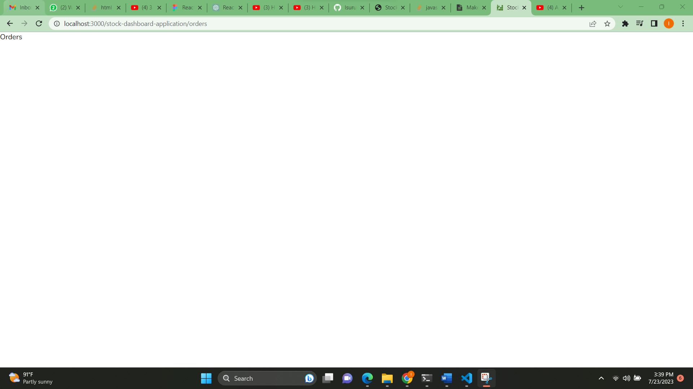
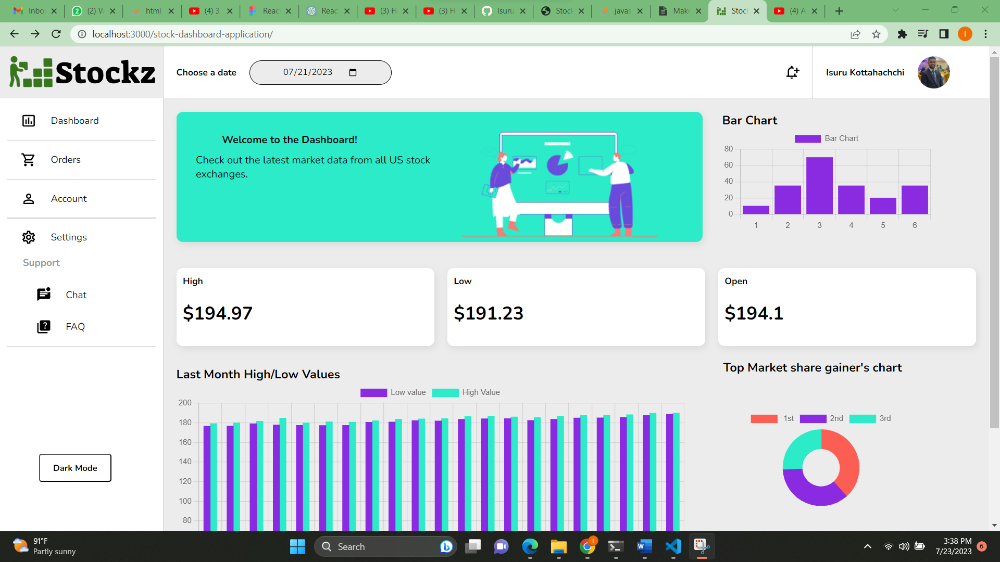
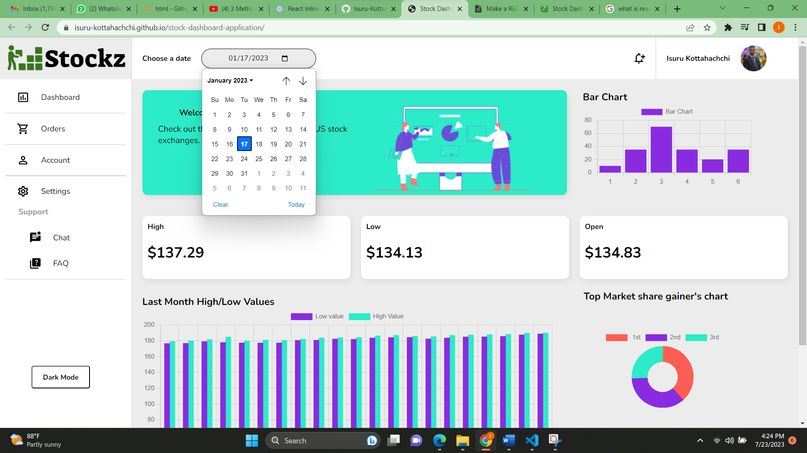
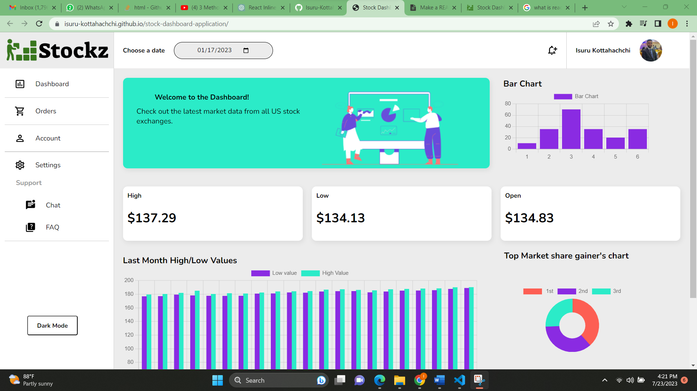
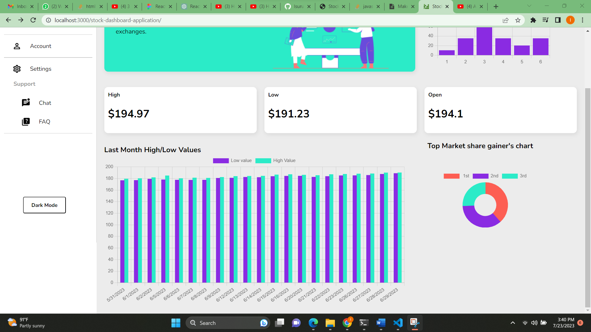
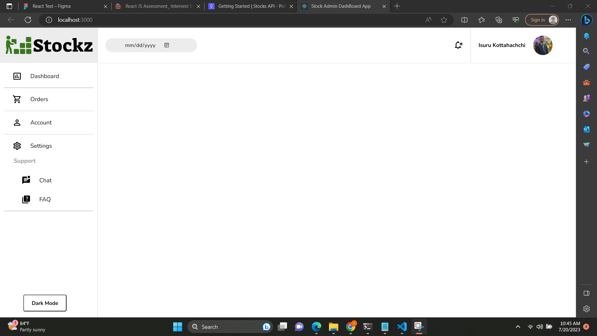
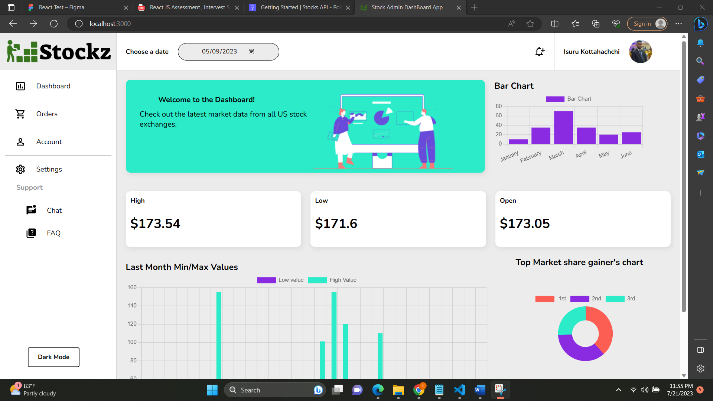
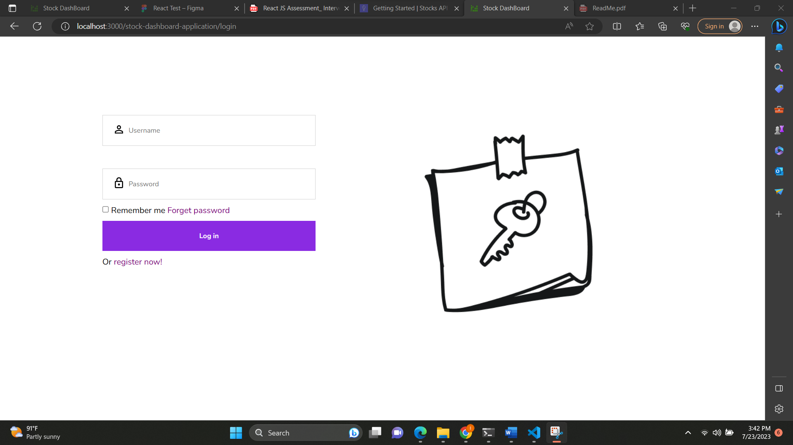

## Description

This is a React project to fetch important data from the stock API and display it to the end user

## Guide to Run the project

Before running this project, you have to clone it.
To clone this, react project from GitHub and run it on your local machine, follow these steps:

If you don't have Git installed on your computer, download and install it from the official website: [https://git-scm.com/](https://git-scm.com)

## Clone the React project:

1.	Go to the GitHub repository of the stock-dashboard-application
2.	Click on the "Code" button and copy the repository URL (you can choose to use HTTPS or SSH).
3.	Open your terminal or command prompt.
4.	Navigate to the directory where you want to clone the project.
5.	Run the following command to clone the project:

## For HTTPS URL:

git clone [https://github.com/Isuru-Kottahachchi/stock-dashboard-application.git](https://github.com/Isuru-Kottahachchi/stock-dashboard-application.git
)

## For SSH UR

git clone git@github.com:Isuru-Kottahachchi/stock-dashboard-application.git

## Install project dependencies:

- Navigate into the cloned project directory:

cd repo
cd - Change directory

- If you use npm for package management, run the following command to install the project dependencies in git bash

`npm install`   

- If you use Yarn for package management, use the following command instead

`yarn install`

## Run the React app:

- Once the dependencies are installed, you can start the development server and run the React app with the following command:

`npm start`

or

`yarn start`

- This command will start the development server, and your React app will be accessible at [http://localhost:3000/stock-dashboard-application/](http://localhost:3000/stock-dashboard-application) or another specified port if the default port is already in use.

- In this case, you also can use Visual studio as an IDE to simplifier the process.

## API Configuration

Users have to create their own API key to access data from the Polygon Stock API. Users are allowed to sign in using a GitHub account or by providing an email and a password. Then they can create their own API key to access the Stock API. [https://polygon.io/docs/stocks/getting-started](https://polygon.io/docs/stocks/getting-started)

## Functionalities

- Each left menu item is clickable, except the dashboard. If a user clicks on a menu item, expect dashboard, they will be led to a blank page by using a Link component in the react router DOM.

When clicks on the Orders tab in left menue

- When the dashboard is loaded for the first time,by default, the date two days before today is selected in the date filter on navigation bar. The user can then choose a trading date using the date filter(calendar input) and check the high, low, and open values of a particular day.

- Users are able to see the high and low values of the previous month at the bottom of the dashboard in a grouped bar chart. (API does not provide weekend day high or low values)

- Dummy data added to the doughnut chart (Circle-shaped chart) component in the dashboard as per the instructions.

## Used additional tools and libraries

- Material UI library used to add icons in navbar and side bar of the stock dashboard.

- Chart Js library is used to create charts.

- Used Nunito Google font family

- Visual studio IDE

## Testing

• Installed the react testing and jest libraries for the critical components like the navbar using the 
react-testing library and jest.

## Security best practices

- Minimized the use of inline styles and scripts in react components.

- Used JSX (JavaScript XML) syntaxes in components to manage and update the DOM. It also avoids direct DOM manipulation to reduce the risk of introducing security vulnerabilities.

## Code formatting and quality techniques

- Used meaningful and descriptive variable names for the variables to enhance the code readability.

- Code indentations done properly to increase the code readability.

- Separate SAS (scss) files are used for components and pages because it is easy to write CSS styles, allows for nested CSS stylings and is easy to read.

## Observations

- Sometimes Stocks API gives 403 and 404 errors when trying to fetch data from some trading 
dates (especially Weekends). It also gives a 429 error when fetching a few dates because it allows only 5 API Calls per minute.

## Note

- Terminal can show a few warnings, like "Line 4:19: 'ChartJS' is defined but never used. 
no-unused-vars but never used.’ But those imports are very important for the application. If 
they remove runtime errors, there can be runtime errors.

- 	Sometimes dates will not fetch from the API when an application has surpassed its rate limit, or the number of requests it can send in a given period of time. ( Only 5 API Calls / Minute 
allowed in free plan)

### Additional Screenshots

